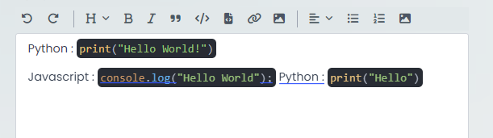

# @nartix/tiptap-inline-code-highlight

This package is a port of `@tiptap/extension-code-block-lowlight` but for highlighting inline codes in the TipTap editor. It uses Lowlight to highlight codes.

### Usage

```bash
npm install @nartix/tiptap-inline-code-highlight
```

### Import the extension:

```javascript
import CodeInlineLowlight from '@nartix/tiptap-inline-code-highlight';
```

### Add it to your Tiptap editor:

```javascript
const editor = Editor({
  extensions: [
    CodeInlineLowlight.configure({
      lowlight,
    }),
  ],
});
```

### Demo


